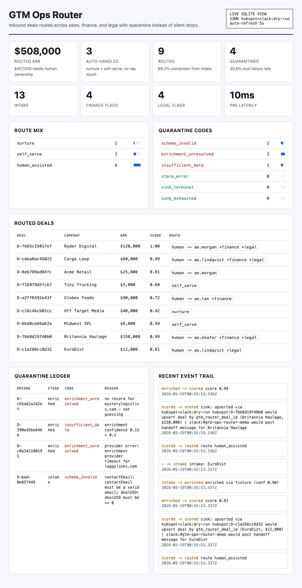

# gtm-ops-router

**A working slice of the Strategy & Ops Engineer role, built for HappyRobot.**

Inbound deal → enrich → score → route across **sales / finance / legal**, with
typed failure handling, idempotent persistence, and live observability. No
mock-ups. It runs.

---

## Why this exists

HappyRobot sells the thesis that AI workforces make manual operations
obsolete. The internal-ops function should be the first proof of that thesis,
not the last. The JD names the target directly:

> *"Improve go-to-market operations by building better tooling between sales,
> finance, and legal."*

At S23 → $60M scale, the place leverage leaks is the **handoff**: an inbound
deal that should be auto-qualified instead waits on a human; a $150K regulated
deal reaches an AE with no finance or legal context; a malformed record gets
silently dropped and nobody knows until the quarter closes. This is a small,
real system that closes those leaks.

---

## Run it (about 60 seconds)

Prereq: **Node ≥ 22.5** — uses the built-in SQLite, so zero native deps by
choice. Authored and tested on Node 25.2.1. On older Node a preflight prints a
one-line fix and exits cleanly, instead of a stack trace. Not claiming
universal; claiming honest about its floor.

```bash
npm install
npm run demo            # deterministic batch — no API keys, no ports (dry-run)
npm run demo -- --integrations # same run, HubSpot + Slack dry-run receipts
npm run demo -- --flaky # same data, live sink faults: retry-then-succeed + a terminal reject
npm run doctor          # live HubSpot/Slack setup check; no secrets printed
npm test                # TypeScript suite, incl. every failure mode

# Dashboard proof surface:
npm run run -- data/inbound.seed.jsonl --integrations  # seed SQLite with HubSpot + Slack receipts
npm run serve -- --integrations                       # open http://localhost:8787

# Python side (stdlib only — the JD names Python explicitly):
python3 ops_audit.py --db data/router.db  # data-integrity + SLO gate; exit 1 on breach
python3 -m unittest test_ops_audit        # Python tests
```

`npm run demo` prints the same proof in the terminal. The dashboard renders it
as an operator view: KPIs, route mix, routed deals, quarantine ledger, and an
event trail, all backed by the same SQLite store. Node prints one
`ExperimentalWarning: SQLite ...` line — expected, the disclosed cost of zero
native deps, not a defect.

### Live HubSpot + Slack

Dry-run integrations are the default proof path: they show the exact HubSpot
upsert and Slack handoff in the event trail without needing secrets. To point
the same flow at real systems:

```bash
cp .env.example .env
# fill HUBSPOT_ACCESS_TOKEN, HUBSPOT_DEAL_EXTERNAL_ID_PROPERTY,
# HUBSPOT_WEBHOOK_SECRET, PUBLIC_BASE_URL, HUBSPOT_NOTIFY_STAGE_IDS,
# SLACK_BOT_TOKEN, and SLACK_CHANNEL_ID

npm run doctor                 # checks env, HubSpot property uniqueness, Slack auth
npm run doctor -- --send-test  # additionally posts one Slack test message
npm run run -- data/inbound.seed.jsonl --live-integrations
npm run serve -- --live-integrations
```

The HTTP surface binds `127.0.0.1` by default. Keep `/deals` on localhost, a
trusted internal network, or an authenticated reverse proxy; Slack rendering
assumes deal text is operator-controlled rather than public attacker input.

`HUBSPOT_DEAL_EXTERNAL_ID_PROPERTY` must be a **unique deal property** in your
HubSpot portal. That is not ceremony: it keeps retries and re-runs idempotent
instead of creating duplicate deals. Slack messages include the router deal id
and HubSpot receipt so a human can trace the handoff.

The server also accepts HubSpot deal-stage webhooks at
`POST /webhooks/hubspot`. Subscribe the HubSpot app to the deal `dealstage`
property change event and point the target URL at that path. When a router-owned
deal is moved in HubSpot, the router records the external stage on the same
SQLite row, dedupes HubSpot retry deliveries, updates the dashboard, and posts a
Slack stage-change message. Live mode requires `HUBSPOT_WEBHOOK_SECRET` so the
webhook endpoint fails closed once exposed. Set `PUBLIC_BASE_URL` to the public
HTTPS origin HubSpot calls so signature verification hashes the same URL
HubSpot signed; only use `TRUST_PROXY=1` when your proxy owns the
`X-Forwarded-*` headers. Live mode also requires `HUBSPOT_NOTIFY_STAGE_IDS`,
a comma-separated allowlist of HubSpot dealstage IDs (for example the internal
ID for "Contact Made") so enabling Slack cannot accidentally alert on every
stage movement in the portal. Dry-run mode may leave it empty to demonstrate
all router-owned stage changes. The allowlist is not retroactive: events
suppressed before a stage ID is allowed stay suppressed unless an operator
deliberately resets or replays that event.

If `npm run doctor` says `gtm_router_deal_id` already exists but is not
unique, create a fresh unique text property instead (for example
`gtm_router_unique_id`) and set `HUBSPOT_DEAL_EXTERNAL_ID_PROPERTY` to that
internal name. HubSpot cannot turn a non-unique property into a safe upsert
key after the fact. If Slack says `not_in_channel`, invite the app/bot to the
target channel and rerun `npm run doctor -- --send-test`.

---

## Dashboard proof



---

## What the demo proves (these numbers are asserted in the test suite)

```
intake 13 · routed 9 (conv 69.2%) · quarantined 4 (rate 30.8%)
route mix      nurture 1 · self_serve 2 · human_assisted 6
human-gate     pricing_approval 4 · regulated_review 4
quarantine     schema_invalid 1 · enrichment_unresolved 2 · insufficient_data 1
business       routed ARR $508,000 · auto-handled 3 (routed, no rep touch)
```

14 input lines, 9 distinct routed rows: one line duplicates another and is
**deduped at the store** — re-ingesting the same logical deal never
double-counts. 9, not 10, is the point. The default run is dry-run (no
external writes, zero `sink_*` quarantines); `--flaky` injects deterministic
retryable and terminal sink faults so the retry/terminal taxonomy is visible
in the quarantine table, not just asserted in tests. `--integrations` swaps the
sink to HubSpot + Slack dry-run mode, so the event trail shows the cross-system
handoff without credentials. `POST /webhooks/hubspot` completes the loop in the
other direction: manual HubSpot stage movement becomes router state and Slack
signal, rather than a static CRM board.

---

## Design decisions (the judgment, not just the code)

Built to a production bar.

- **Rapid vs. evergreen.** This is an evergreen system (it would run daily for
  years), so it is typed, modular, and tested — not a flat script. Knowing
  which of the two you're building is the whole skill; a one-off campaign
  would correctly get the opposite treatment.
- **Make invalid states unrepresentable.** `src/types.ts` — `Route` is a
  discriminated union, so a `human_assisted` route with no owner cannot be
  constructed. The compiler enforces the business rules.
- **Fail loud, never silent.** Every failure is a typed `Quarantine` with a
  code and a human-readable reason. An unknown company is *not guessed*. A
  persistence error is surfaced as `store_error`; an unexpected per-row throw is
  surfaced as `pipeline_error`. Nothing is ever dropped: routed + quarantined
  always reconciles to intake.
- **Observability is first-class.** Every stage transition is an event row;
  metrics (conversion, quarantine rate by code, route mix, p50/p95 latency)
  are queryable and rendered on a live dashboard and a JSON endpoint. External
  writes return receipts, so HubSpot and Slack outcomes appear in the same
  audit trail as scoring and routing.
- **Idempotency by construction.** Deterministic deal IDs → re-ingest is a
  safe no-op. Data accuracy is a property of the design, not a cron that
  cleans up later.
- **Clone-and-run, within a stated floor.** Zero native build step, zero
  secrets, deterministic demo. `node:sqlite` is loaded via `createRequire` so
  no bundler trips on the experimental specifier, and a preflight degrades an
  old-Node failure to one actionable line. It is not universal: it needs Node
  ≥ 22.5 and was tested on 25.2.1. The tradeoff — no native deps vs. an
  experimental builtin — is deliberate and disclosed, not hidden.

## What I deliberately did NOT automate

Knowing where automation stops is part of the job.

- **The close above $10K stays human.** Buyers will not self-serve at that
  size — trust is the product. The system routes and *prepares* the human
  (owner assigned, finance/legal pre-flagged) so they walk in ready; it never
  tries to replace them.
- **Finance pricing approval and legal regulated-review are flags, not
  decisions.** The system surfaces that they're needed and to whom; a person
  still decides. Automating the *routing* of judgment is leverage; automating
  the *judgment* is how an ops system silently does damage.

That boundary is a deliberate design output, not a missing feature.

## JD requirement → where it's demonstrated

| Their "Must Have" | In this repo |
|---|---|
| Ship real systems, strong SWE fundamentals | runs end-to-end; `tsc` strict + `noUncheckedIndexedAccess`; TS + Python suites |
| Automations/tools w/ **Python**, SQL, APIs, scripting | Python `ops_audit.py` (SLO gate, stdlib, tested); `node:sqlite` store; `node:http` API; HubSpot + Slack REST adapters; cron-shaped `run` |
| Reason about edge cases, failure modes, maintainability | 7 typed quarantine codes incl. injected `store_error`; retryable-vs-terminal sink taxonomy w/ bounded backoff; dry-run |
| Business intuition (cost, speed, scale) | routed/human ARR + auto-handled metrics; `$10K`/`$50K` gates are named policy |
| Extreme ownership, ambiguity | scoped from a one-line JD bullet to a running system; `ASSUMPTIONS.md` + `RUNBOOK.md` |
| Clear communication | this README, runbook, assumptions; one audit note per score dimension |

## What I'd build next (ownership beyond the demo)

- Live `Enricher` adapter (Apollo/Clearbit/internal warehouse) behind the
  existing seam + a circuit breaker; dead-letter requeue after upstream
  recovery. (Retry/backoff, terminal-vs-retryable, dry-run, and the SLO gate
  are already built — see `sink.ts`, `integrations.ts`, and `ops_audit.py`.)
- Auth on `POST /deals`; structured log shipping; alerting wired to the
  existing audit gate.
- **The self-improving loop:** score routing decisions against closed-won
  outcomes, surface the false-positive / missed-pattern quadrants, and tune
  the thresholds from data instead of by hand. (Same loop, pointed at ops.)

## Architecture

```
inbound ─► intake ─► enrich ─► score ─► route ─► sink ───► store ─► dashboard
            (zod)    (seam,   (determ., (sales/  (HubSpot  (sqlite, /metrics
                      no guess) audit)   fin/     upsert +  idempot. (http)
              │          │        │       legal)   Slack)    events)
              └──────────┴────────┴───────┴── any failure ─► typed Quarantine (loud)

data/router.db ─► ops_audit.py   (Python: invariant + SLO gate, exit 1 on breach)
```

Each stage is single-purpose and swappable; the pipeline doesn't change when
an enricher or sink does. `src/` is ~11 small files; read `pipeline.ts` first
— the stage order and error boundaries are the interesting part.

## 90-second walkthrough (for the screen recording)

1. (0:00) "HappyRobot sells autonomous ops. This is a working slice of the
   sales/finance/legal tooling bullet from the JD — built, not mocked."
2. (0:10) `npm run run -- data/inbound.seed.jsonl --integrations && npm run serve -- --integrations`,
   then open `http://localhost:8787` — point at the dashboard metrics: "13 in,
   9 routed, 4 quarantined. Conversion and quarantine-by-code are asserted in
   tests."
3. (0:30) Routed deals: "Ryder, $120K, regulated → human + finance + legal,
   pre-flagged. Off-ICP → nurture, zero rep time. $8K → self-serve."
4. (0:45) Quarantine ledger: "Unknown company is *not guessed* — quarantined
   with a reason. Bad schema, low-confidence data, provider timeout: all
   typed, none dropped."
5. (1:05) `src/types.ts` + `pipeline.ts`: "Invalid states are
   unrepresentable; every failure path is typed and tested."
6. (1:20) Recent event trail: "The same routed deal produces a HubSpot upsert
   receipt and a Slack handoff receipt. In live mode those are real API calls;
   in public demo mode they're deterministic dry-run receipts."

---

Built by Jin Choi as a concrete artifact for the HappyRobot Strategy & Ops
Engineer role. Clone it, run `npm run demo`, read `pipeline.ts`.
